# WorksAuto Backend — Tam Mimari ve Algoritma Şeması

Bu dokümanı editör içinde `Cmd + Shift + V` (Mac) veya `Ctrl + Shift + V` (Windows) tuşlarına basarak görsel şema olarak inceleyebilirsiniz.

---

## 1. 10 Adımlı Uçtan Uca İstek Hattı (Request Pipeline)

```mermaid
flowchart LR
    C["1. Client<br/>(Next.js 16)"] --> E["2. Edge Proxy<br/>(worksauto_session)"]
    E --> H["3. CORS & HSTS<br/>(Security Headers)"]
    H --> G["4. JwtAuthGuard<br/>(tenantId extraction)"]
    G --> R["5. Redis Lock<br/>(Idempotency Key)"]
    R --> V["6. ValidationPipe<br/>(class-validator DTO)"]
    V --> Ctrl["7. Controller<br/>(Presentation Layer)"]
    Ctrl --> UC["8. UseCase<br/>(Application Layer)"]
    UC --> DB[("9. Prisma & Postgres<br/>(WHERE tenantId = ...)")]
    UC --> WS["10. Socket.IO<br/>(Chime / EventBus)"]

    style C fill:#082f49,stroke:#38bdf8,stroke-width:2px,color:#fff
    style E fill:#082f49,stroke:#38bdf8,stroke-width:2px,color:#fff
    style H fill:#1e1b4b,stroke:#818cf8,stroke-width:2px,color:#fff
    style G fill:#1e1b4b,stroke:#818cf8,stroke-width:2px,color:#fff
    style R fill:#451a03,stroke:#fbbf24,stroke-width:2px,color:#fff
    style V fill:#451a03,stroke:#fbbf24,stroke-width:2px,color:#fff
    style Ctrl fill:#064e3b,stroke:#34d399,stroke-width:2px,color:#fff
    style UC fill:#064e3b,stroke:#34d399,stroke-width:2px,color:#fff
    style DB fill:#4c0519,stroke:#f43f5e,stroke-width:2px,color:#fff
    style WS fill:#4c0519,stroke:#f43f5e,stroke-width:2px,color:#fff
```

---

## 2. Optimize Edilmiş 8 Modül Matrisi & Fonksiyon Blokları

